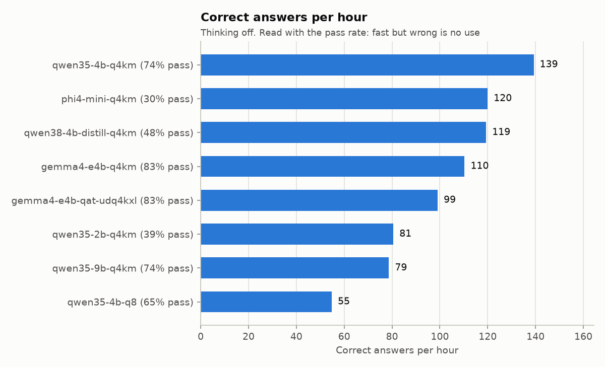
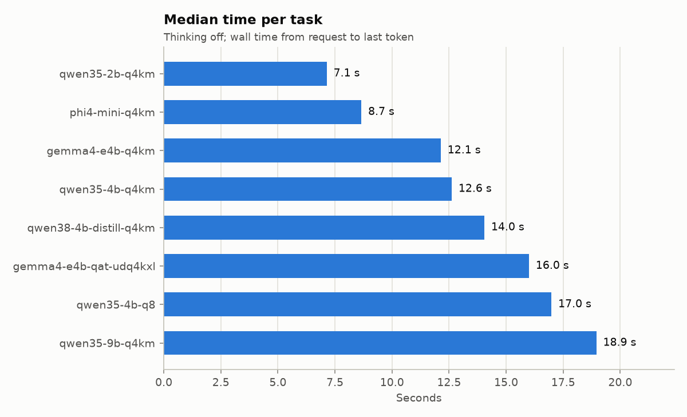
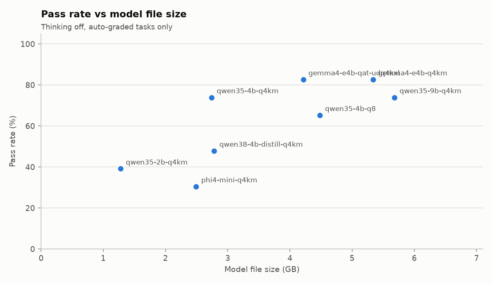
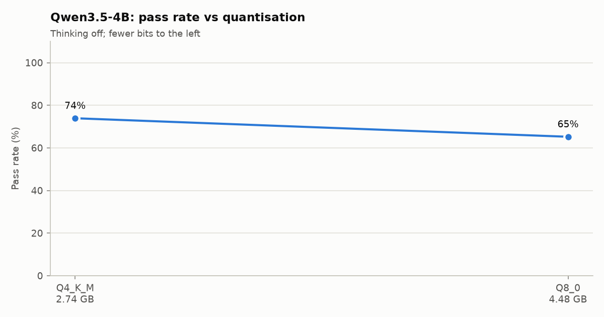

# Harness report

Generated 2026-09-25 14:37 from `runs.jsonl` (200 current runs; 24 tasks in `tasks.yaml`). Sorted by correct answers per hour.

- **Correct answers per hour** = passed auto-graded runs ÷ hours of wall time spent on them.
- Thinking-on configs run only the tasks marked `thinking: on/both`, so compare them with care.
- Memory = sum of llama-server buffers (weights + KV cache + recurrent state + compute).

## Overview

| Config | Quant | File GB | Thinking | Runs | Passed | Pass rate | Correct/hour | Median s/task | Median first answer s | Decode tok/s | Mean tokens/run | Memory GiB | Manual | Cut off |
|---|---|---|---|---|---|---|---|---|---|---|---|---|---|---|
| `qwen35-4b-q4km-vulkan-nothink` | Q4_K_M | 2.74 | off | 24 | 17/23 | **74%** | **139** | 12.6 | 1.5 | 14.2 | 243 | 3.69 | 1 | 0 |
| `phi4-mini-q4km-vulkan-nothink` | Q4_K_M | 2.49 | off | 24 | 7/23 | **30%** | **120** | 8.7 | 0.6 | 17.6 | 148 | 4.88 | 1 | 0 |
| `qwen38-4b-distill-q4km-vulkan-nothink` | Q4_K_M | 2.78 | off | 24 | 11/23 | **48%** | **119** | 14.0 | 1.5 | 15.3 | 193 | 3.66 | 1 | 0 |
| `gemma4-e4b-q4km-vulkan-nothink` | Q4_K_M | 5.34 | off | 24 | 19/23 | **83%** | **110** | 12.1 | 1.1 | 13.9 | 343 | 5.69 | 1 | 0 |
| `gemma4-e4b-qat-udq4kxl-vulkan-nothink` | UD-Q4_K_XL | 4.22 | off | 24 | 19/23 | **83%** | **99** | 16.0 | 0.9 | 12.3 | 344 | 4.48 | 1 | 0 |
| `qwen35-2b-q4km-vulkan-nothink` | Q4_K_M | 1.28 | off | 24 | 9/23 | **39%** | **81** | 7.1 | 0.6 | 26.8 | 434 | 1.86 | 1 | 1 |
| `qwen35-9b-q4km-vulkan-nothink` | Q4_K_M | 5.68 | off | 24 | 17/23 | **74%** | **79** | 18.9 | 2.0 | 9.1 | 268 | 5.97 | 1 | 0 |
| `qwen35-4b-q8-vulkan-nothink` | Q8_0 | 4.48 | off | 24 | 15/23 | **65%** | **55** | 17.0 | 1.4 | 11.4 | 448 | 5.45 | 1 | 1 |
| `qwen35-4b-q4km-vulkan-think` | Q4_K_M | 2.74 | on | 8 | 7/8 | **88%** | **12** | 215.6 | 204.0 | 14.0 | 3783 | 3.69 | 0 | 0 |

## Pass rate by category

| Config | small function | bug finding | sql regex | explain code | maths logic | instruction following | summarise |
|---|---|---|---|---|---|---|---|
| `qwen35-4b-q4km` | 4/6 | 2/4 | 4/4 | 0/1 | 3/3 | 2/3 | 2/2 |
| `phi4-mini-q4km` | 1/6 | 2/4 | 1/4 | 0/1 | 2/3 | 1/3 | 0/2 |
| `qwen38-4b-distill-q4km` | 1/6 | 1/4 | 2/4 | 0/1 | 3/3 | 2/3 | 2/2 |
| `gemma4-e4b-q4km` | 3/6 | 4/4 | 4/4 | 0/1 | 3/3 | 3/3 | 2/2 |
| `gemma4-e4b-qat-udq4kxl` | 4/6 | 4/4 | 3/4 | 0/1 | 3/3 | 3/3 | 2/2 |
| `qwen35-2b-q4km` | 1/6 | 2/4 | 1/4 | 0/1 | 3/3 | 1/3 | 1/2 |
| `qwen35-9b-q4km` | 3/6 | 4/4 | 3/4 | 0/1 | 3/3 | 2/3 | 2/2 |
| `qwen35-4b-q8` | 2/6 | 2/4 | 3/4 | 0/1 | 3/3 | 3/3 | 2/2 |
| `qwen35-4b-q4km-think` | – | 4/4 | – | 0/1 | 3/3 | – | – |

## Per task

✓ = passed every repeat, ✗ = failed every repeat, `p/n` = mixed, M = needs manual grading, blank = not run.

| Task | Category | `qwen35-4b-q4km` | `phi4-mini-q4km` | `qwen38-4b-distill-q4km` | `gemma4-e4b-q4km` | `gemma4-e4b-qat-udq4kxl` | `qwen35-2b-q4km` | `qwen35-9b-q4km` | `qwen35-4b-q8` | `qwen35-4b-q4km-think` |
|---|---|---|---|---|---|---|---|---|---|---|
| `py-parse-date` | small function | ✓ | ✓ | ✗ | ✓ | ✓ | ✗ | ✓ | ✗ |  |
| `py-normalise-order` | small function | ✓ | ✗ | ✗ | ✗ | ✗ | ✗ | ✓ | ✗ |  |
| `py-merge-slots` | small function | ✓ | ✗ | ✓ | ✓ | ✓ | ✓ | ✓ | ✓ |  |
| `js-parse-query` | small function | ✓ | ✗ | ✗ | ✓ | ✓ | ✗ | ✗ | ✓ |  |
| `js-deep-merge` | small function | ✗ | ✗ | ✗ | ✗ | ✓ | ✗ | ✗ | ✗ |  |
| `cpp-parse-duration` | small function | ✗ | ✗ | ✗ | ✗ | ✗ | ✗ | ✗ | ✗ |  |
| `bug-py-paginate` | bug finding | ✗ | ✗ | ✗ | ✓ | ✓ | ✗ | ✓ | ✗ | ✓ |
| `bug-py-split-pence` | bug finding | ✓ | ✓ | ✓ | ✓ | ✓ | ✓ | ✓ | ✓ | ✓ |
| `bug-js-top-scores` | bug finding | ✓ | ✓ | ✗ | ✓ | ✓ | ✓ | ✓ | ✓ | ✓ |
| `bug-sql-left-join` | bug finding | ✗ | ✗ | ✗ | ✓ | ✓ | ✗ | ✓ | ✗ | ✓ |
| `sql-top-customers` | sql regex | ✓ | ✓ | ✓ | ✓ | ✓ | ✓ | ✓ | ✓ |  |
| `sql-monthly-running-total` | sql regex | ✓ | ✗ | ✗ | ✓ | ✓ | ✗ | ✓ | ✓ |  |
| `sql-latest-status` | sql regex | ✓ | ✗ | ✗ | ✓ | ✗ | ✗ | ✗ | ✗ |  |
| `py-regex-log-line` | sql regex | ✓ | ✗ | ✓ | ✓ | ✓ | ✗ | ✓ | ✓ |  |
| `explain-js-event-loop` | explain code | ✗ | ✗ | ✗ | ✗ | ✗ | ✗ | ✗ | ✗ | ✗ |
| `explain-py-rate-cache` | explain code | M | M | M | M | M | M | M | M |  |
| `math-batch-job` | maths logic | ✓ | ✓ | ✓ | ✓ | ✓ | ✓ | ✓ | ✓ | ✓ |
| `math-sla-downtime` | maths logic | ✓ | ✓ | ✓ | ✓ | ✓ | ✓ | ✓ | ✓ | ✓ |
| `math-pin-count` | maths logic | ✓ | ✗ | ✓ | ✓ | ✓ | ✓ | ✓ | ✓ | ✓ |
| `if-three-bullets` | instruction following | ✗ | ✗ | ✗ | ✓ | ✓ | ✗ | ✗ | ✓ |  |
| `if-json-extract` | instruction following | ✓ | ✗ | ✓ | ✓ | ✓ | ✗ | ✓ | ✓ |  |
| `if-one-sentence` | instruction following | ✓ | ✓ | ✓ | ✓ | ✓ | ✓ | ✓ | ✓ |  |
| `sum-incident` | summarise | ✓ | ✗ | ✓ | ✓ | ✓ | ✓ | ✓ | ✓ |  |
| `sum-release-notes` | summarise | ✓ | ✗ | ✓ | ✓ | ✓ | ✗ | ✓ | ✓ |  |

## Charts

## Needle in a haystack (`lab needle`)

| Machine | Config | Prompt tokens | Depth | Found | Prefill s | Prefill tok/s | Answer |
|---|---|---|---|---|---|---|---|
| laptop | `qwen35-4b-q4km-vulkan-nothink` | 4042 | 0.50 | yes | 19.6 | 206 | `7481-QX` |
| laptop | `qwen35-4b-q4km-vulkan-nothink` | 16377 | 0.50 | yes | 178.3 | 92 | `7481-QX` |
| laptop | `qwen35-4b-q4km-vulkan-nothink` | ~32768 | 0.50 | **error**: {"code": 500, "message": "decode() failed: vk::Device::getFe | – | – | `` |

## llama-bench (`lab bench`)

| Date | Machine | Config | Build | Test | t/s | ± |
|---|---|---|---|---|---|---|
| 2026-09-25T13:23 | laptop | `qwen35-4b-q4km-vulkan-nothink` | 11157 | pp48 | 81.19 | 3.06 |
| 2026-09-25T13:23 | laptop | `qwen35-4b-q4km-vulkan-nothink` | 11157 | pp50 | 82.08 | 0.54 |
| 2026-09-25T13:23 | laptop | `qwen35-4b-q4km-vulkan-nothink` | 11157 | pp51 | 83.69 | 1.01 |
| 2026-09-25T13:23 | laptop | `qwen35-4b-q4km-vulkan-nothink` | 11157 | pp52 | 89.90 | 0.53 |
| 2026-09-25T13:23 | laptop | `qwen35-4b-q4km-vulkan-nothink` | 11157 | pp55 | 91.15 | 2.30 |
| 2026-09-25T13:23 | laptop | `qwen35-4b-q4km-vulkan-nothink` | 11157 | pp56 | 95.66 | 1.08 |
| 2026-09-25T13:23 | laptop | `qwen35-4b-q4km-vulkan-nothink` | 11157 | pp64 | 102.13 | 1.46 |
